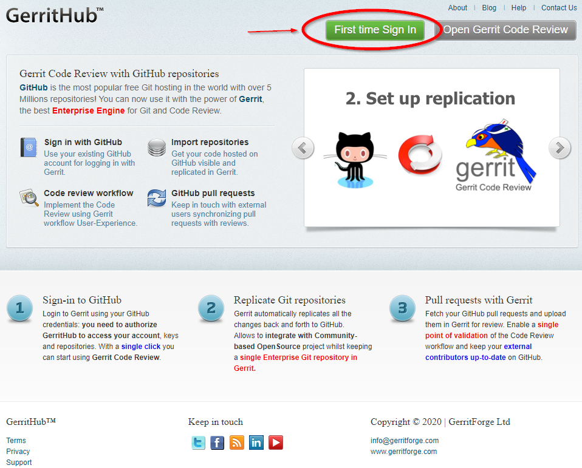

# E-Portfolio-Gerrit
This is a Repository for the E-Portfolio about Gerrit Code Review.

Some References:
- [Here is my gerrit repository](https://review.gerrithub.io/plugins/gitiles/SirHrtmn/E-Portfolio-Gerrit/+/refs/heads/main) which you can access on the public gerrit instance [gerrithub.io](http://gerrithub.io). 

- [My slides](https://slides.com/sirhrtmn/deck) The slides are also uploaded as html file but when you open it on GitHub you wont see anything. So either use this link or download the html file and open it via your browser. Sorry for that :(

There is also a [Gerrit Documentation Site](https://gerrit-documentation.storage.googleapis.com/Documentation/3.4.0/index.html) and the [Official Website](https://www.gerritcodereview.com/) where you can have addition information about Gerrit itself. Maybe [this old Gerrit Wiki Website](https://gerrit.googlesource.com/homepage/+/master/pages/site/docs/) could also help you, if you want to use Gerrit Code Review.

If you want to use Gerrit privately my recommandation would be [gerrithub.io](http://gerrithub.io) where you can integrate existing GitHub Repositories. Unfortunately, I didn't find any possibility to keep your already linked GitHub Repository updated, while working on the repository in gerrithub.io. But if you still want to use gerrithub.io you can follow the following small tutorial. 

## How to set up GerritHub.io
This following tutorial requires an existing GitHub account and a existing GitHub Repository hosted by the same account;

- Go to [gerrithub.io](http://gerrithub.io)
- Click on "First Time Sign In"
  
- Read the description and the click "Sign In"
  
- On the "Login Scope Selection" select the option "Private" and click "Login"
  - so you can also push code into the imported repository rather than only be able to review existing code
  
- Then login to your GitHub account and select which repositories you want to import. 

That's all!

## General Workflow of Gerrit Code Review
The general Workflow of gerrit would look like this: 

1. Making the change
2. Creating the review
3. Reviewing the change
4. Reworking the change
5. Verifying the change
6. Submitting the change

The best walkthrough would be this one: [Gerrit-Walktrough](https://git.eclipse.org/r/Documentation/intro-gerrit-walkthrough.html)
It is a walktrough from the official documentation website of gerrit where each Step is explained in detail.
